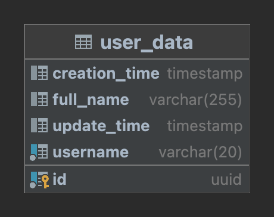
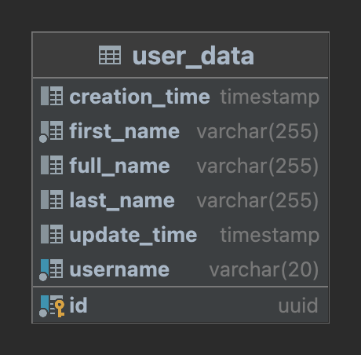
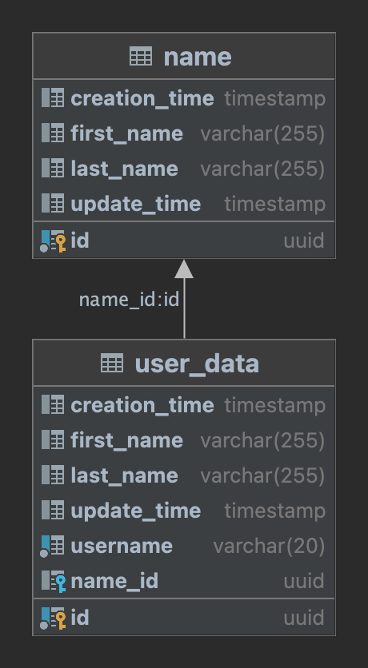
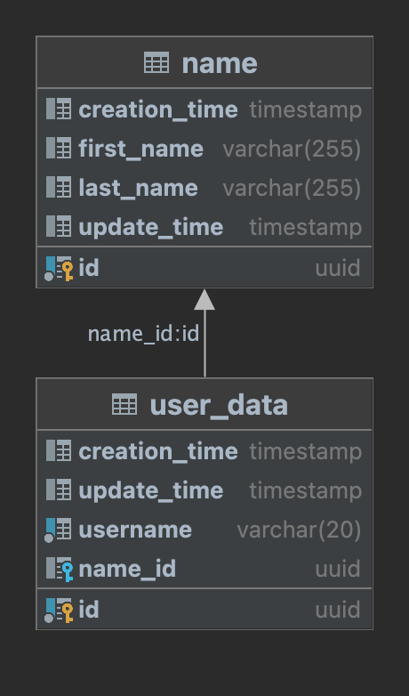

# user-service
Demo project as proof of concept for my bachelor's thesis.

## About The Project
This project models a user service as a web application.
Through the implementation and evolution of this service, versioning of REST APIs using query parameters and providing data backward-compatibility using _Expand-Contract migrations_ are evaluated in the context of my bachelor's thesis.
This demo user service will undergo three changes resulting in four versions.
The first change is a change of contract and describe an API change, handled in a forward- and backward-compatible manner.
The latter two changes do not change the contract and describe a database change.

#### Version 1.0.0: Simple API
A ```user_data```-entity is represented by the attributes ```id```, ```username``` and ```full_name```:



The API supports ```GET```, ```POST```, ```PUT``` and ```DELETE``` methods via the endpoint: ```user/{username}```, and fetches, posts, updates and deletes a user respectively.

#### Version 2.0.0: Versioned API
A ```user_data```-entity is represented by the attributes ```username```, ```full_name```, ```first_name``` and ```last_name```:



This change supports a version of ```user_data```-entity described in [Version 1.0.0](#version-100-simple-api), and can be addressed by specifying the version as a query parameter in the following way: ```user/{username}?version=1```.
The new version of ```user_data```-entity, including only the attributes ```username```, ```first_name``` and ```last_name```, can be addressed by specifying the new version as a query parameter in the following way: ```user/{username}?version=2```.  
The new default version without any query parameters includes all attributes for ```GET``` and ```DELETE``` and determines the response version by the format of ```POST``` and ```PUT``` requests.
In this way, the API is backward-compatible. It is also forward-compatible as clients running the old version still receive the expected data, even when they don't specify the version, and can simply ignore the newly added fields.

[Version 1.0.0](#version-100-simple-api) will no longer be supported in the next [version](#version-210-deprecation-and-migrating-database).
Therefore, it is necessary to perform a one-time data migration, writing ```full_name``` to ```first_name``` and ```last_name``` for entries created in [Version 1.0.0](#version-100-simple-api). The new ```name```-entity mirrors the latter two attributes of the ```user_data```-entity in preparation of the database migration.
The migration can be performed using the endpoint ```users/migrate```.

#### Version 2.1.0: Deprecation and Migrating Database
A ```user_data```-entity is represented by the attributes ```username```, ```first_name```, ```last_name``` and a nullable foreign key ```name_id```.
The latter links to a ```name```-entity, represented by the attributes ```id```, ```first_name``` and ```last_name```:



In this version, the old version of the ```user_data```-entity and its representation is deprecated and is no longer supported.
*Dark Reads* and *Duplicate Writes* access both entities and ensure data consistency. 
Before reaching the next version, a one-time data migration has to be performed, writing all the entries of the ```user_data```-entity that have been created before [this version](#version-210-deprecation-and-migrating-database) into ```name```-entities.
The migration can be performed using the endpoint ```users/migrate```.

#### Version 2.2.0: Migrated Database
A ```user_data```-entity is represented by the attributes ```username``` and ```name_id``` as a non-nullable foreign key.
The latter links to a ```name```-entity with the attributes ```id```, ```first_name``` and ```last_name```.



Due to the data migration, the nullable property of ```name_id``` as a foreign key can be safely removed.
The API endpoint has not changed, and thus the perceived behavior of the API stays the same.   

### Built With
- Docker
- Spring Initializr
- Liquibase
- Hibernate
- Tomcat

## Getting Started

### Prerequisites
Set up PostgreSQL docker image, to be used as a local database:
```shell
docker run --name postgres -d -p 127.0.0.1:8001:5432 -e POSTGRES_PASSWORD=password postgres
```
The following parameters can be customized with custom inputs:
- ```--name``` name of the docker image
- ```-p``` port-mapping
- ```-e POSTGRES_PASSWORD``` password for the PostgreSQL

### Installation
```shell
git clone https://github.com/Cifer0/user-service.git
```
First, go into the ```src/main/resources/application.properties``` file and check if the following entries match the above-mentioned parameters of the docker image:
- ```spring.datasource.url=jdbc:postgresql://localhost:5432/```
- ```spring.datasource.username=postgres```
- ```spring.datasource.password=password```

Do the same for the ```liquibase.properties``` and the following entries:
- ```url=jdbc:postgresql://localhost:5432/postgres```
- ```username=postgres```
- ```password=password```

Before the first application launch, go to ```src/main/resources/application.properties``` file and set the entry ```spring.jpa.hibernate.ddl-auto=create```.
This will create all the database tables from the entities.
After creation of the tables, for subsequent application launches, the attribute has to be set as the following: ```spring.jpa.hibernate.ddl-auto=validate```.
This allows for changes to the database to persist after stopping the application and allows for a persistent behavior between application starts, which is a condition for **liquibase** to run smoothly.

The inclusion of an initial data set proves to be difficult due to the configuration of ```src/main/resources/application.properties```, which is configured in favor of **liquibase**.
Instead, a set of **cURL**-commands and the corresponding request body will be provided by stage to fill the database manually, in the following:

#### Version 1.0.0
```shell
curl -i -X POST http://localhost:8080/user/john -H 'Content-Type: application/json' -d '{"fullName": "John Doe"}'
```
```json
{
 "username": "john",
 "fullName": "John Doe"
}
```
Note: Sending ```username``` in the request body is optional, but if it is sent, it will have to match the username in the path.

#### Version 2.0.0
```shell
curl -i -X POST http://localhost:8080/user/john?version=1 -H 'Content-Type: application/json' -d '{"fullName": "John Doe"}'
```
```json
{
 "username": "john",
 "fullName": "John Doe"
}
```
```shell
curl -i -X POST http://localhost:8080/user/jane?version=2 -H 'Content-Type: application/json' -d '{"firstName": "Jane", "lastName": "Doe"}'
```
```json
{
 "username": "jane",
 "firstName": "Jane",
 "lastName": "Doe"
}
``` 

#### Version 2.1.0 & 2.2.0
```shell
curl -i -X POST http://localhost:8080/user/john -H 'Content-Type: application/json' -d '{"firstName": "John", "lastName": "Doe"}'
```
```json
{
 "username": "john",
 "firstName": "John",
 "lastName": "Doe"
}
```

Note: Sending ```username``` in the request body is optional, but if it is sent, it will have to match the username in the path.

## Roadmap
- [x] Build project with Spring Initializr
- [x] Add README.md
- [x] Add CHANGELOG.md
- [x] Add LICENSE.txt
- [x] [Version 1.0.0](#version-100-simple-api)
- [x] [Version 2.0.0](#version-200-versioned-api)
- [ ] [Version 2.1.0](#version-210-deprecation-and-migrating-database)
- [ ] [Version 2.2.0](#version-220-migrated-database)

## License
Distributed under the MIT License. See LICENSE.txt for more information.

## Contact
Young-Keun Choi - young-keun.choi@uni-ulm.de

Project Link: [https://github.com/Cifer0/user-service](https://github.com/Cifer0/user-service) 

## Acknowledgement
* [Spring Initializr](https://start.spring.io)
* [Stack Overflow](https://stackoverflow.com)
